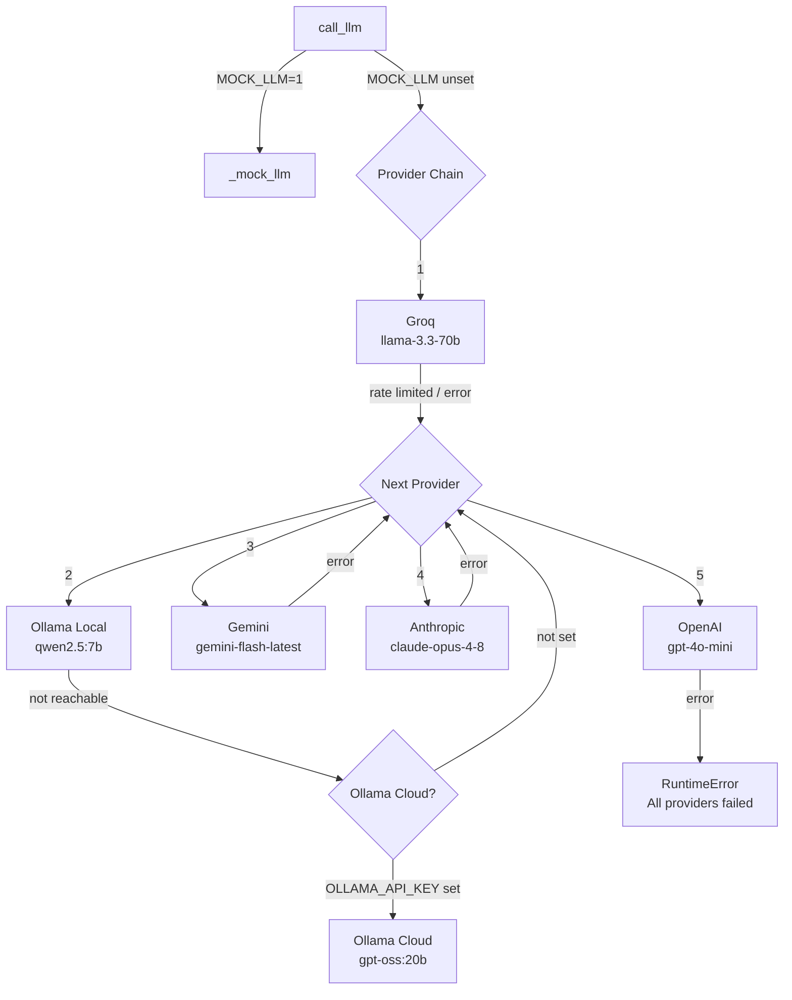
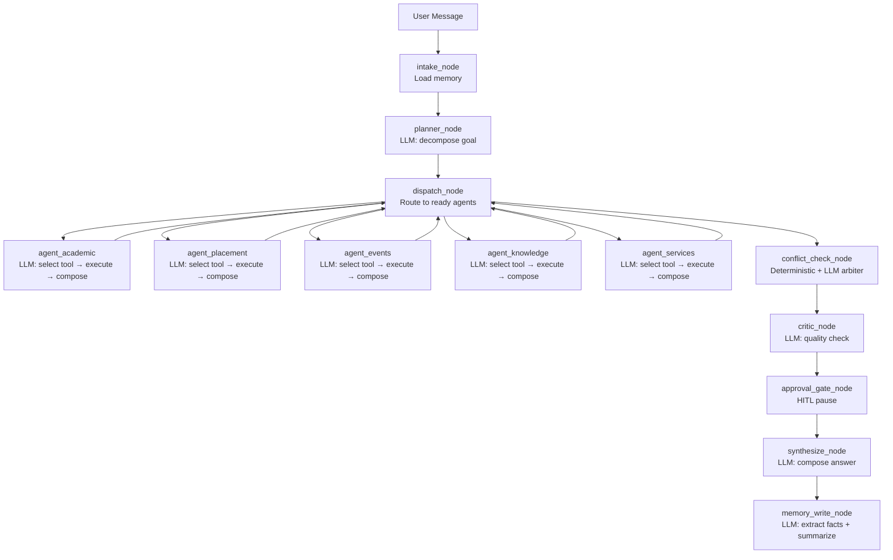

# AI Implementation

Detailed documentation of the AI/ML components in VasaviHub.

## Purpose

VasaviHub uses AI to:
1. **Decompose** student questions into structured multi-step plans
2. **Select tools** for each specialist agent based on context
3. **Compose** step results from tool outputs
4. **Detect conflicts** in edge cases not caught by deterministic rules
5. **Evaluate** whether the plan answered the question (critic)
6. **Extract** durable student facts and summarize conversations for memory

## Models Used

| Model | Provider | Purpose | Configurable |
|-------|----------|---------|-------------|
| `llama-3.3-70b-versatile` | Groq | Primary LLM for all graph nodes | Yes (`GROQ_MODEL`) |
| `gemini-flash-latest` | Google | LLM fallback | Hardcoded |
| `qwen2.5:7b` | Ollama (local) | LLM fallback | Yes (`OLLAMA_LOCAL_MODEL`) |
| `gpt-oss:20b-cloud` | Ollama (cloud) | LLM fallback | Yes (`OLLAMA_CLOUD_MODEL`) |
| `claude-opus-4-8` | Anthropic | LLM fallback | Hardcoded |
| `gpt-4o-mini` | OpenAI | LLM fallback | Hardcoded |
| `all-MiniLM-L6-v2` | SentenceTransformers | Embeddings for RAG | Hardcoded |

## AI Provider Chain

**File:** `apps/api/llm/router.py`



**Key behaviors:**
- Provider timeout: 25s per provider (`PROVIDER_TIMEOUT_S`)
- Whole-call deadline: 20s (`LLM_CALL_TIMEOUT_S`)
- Groq key rotation: multiple keys tried in sequence on rate limit
- Client caching: TLS connections reused across calls
- IPv4 forced by default (IPv6 DNS resolution measured at 21s)
- `max_retries=0` on all SDK clients — retry strategy is key rotation, not backoff

## Prompt Architecture

Each graph node uses a distinct system prompt. All prompts are defined as string constants in `apps/api/graph/nodes.py` and `apps/api/graph/agents.py`.

### Planner Prompt

**Location:** `nodes.py` — `planner_node()`

The planner receives:
- User goal
- Memory block (profile facts + semantic recall)
- Step results from any prior iteration
- Previous plan (if revising)
- Conflict/arbiter feedback (if replanning)

**Output:** JSON matching `PLAN_JSON_INSTRUCTIONS` from `packages/contracts/plan.py`:

```json
{
  "goal": "string",
  "reasoning": "string",
  "steps": [
    {
      "id": "s1",
      "agent": "academic|placement|events|knowledge|services",
      "task": "string",
      "depends_on": [],
      "expected_output": "string",
      "requires_approval": false
    }
  ]
}
```

The planner also handles:
- **Greetings** — returns empty steps with a reply (no agents needed)
- **Capability questions** — returns empty steps with system description
- **Thanks** — returns empty steps with acknowledgement

### Agent Tool Selection Prompt

**Location:** `agents.py` — `make_agent_node()`

Each specialist agent receives:
- The step's task description
- Available tools (only tools owned by that agent)
- Tool descriptions and expected arguments

**Output:** JSON with one tool selection:

```json
{
  "tool": "tool_name",
  "args": {"arg": "value"},
  "reasoning": "why this tool"
}
```

**Constraint:** Each agent calls AT MOST ONE tool per step. This is enforced by the prompt and is load-bearing — a single "do everything" step would silently drop side effects.

### Agent Composition Prompt

**Location:** `agents.py` — compose call

After tool execution, the agent composes a step result:

```json
{
  "output": "string",
  "reasoning": "string",
  "data": {}
}
```

### Conflict Arbiter Prompt

**Location:** `nodes.py` — `conflict_check_node()`

Two-phase conflict detection:

1. **Deterministic preflight** — checks real timetable for collisions, computes attendance impact
2. **LLM arbiter** — only invoked if no deterministic conflict found; handles edge cases

**Output:**

```json
{
  "conflicts": [
    {
      "type": "SCHEDULE_COLLISION",
      "step_id": "s2",
      "detail": "string"
    }
  ],
  "rationale": "string"
}
```

### Critic Prompt

**Location:** `nodes.py` — `critic_node()`

Evaluates whether the plan answered the student's question.

**Output:**

```json
{
  "satisfied": true,
  "feedback": ""
}
```

### Memory Extraction Prompt

**Location:** `memory/__init__.py`

Two LLM calls per turn:

1. **Fact extraction:**
   ```
   From this exchange, extract durable facts about the student...
   {"facts": [{"key": "preference.schedule", "value": "morning sessions", "confidence": 0.9}]}
   ```

2. **Turn summary:**
   ```
   Summarize this exchange in at most two sentences...
   {"summary": "The student asked about Google internship eligibility..."}
   ```

### Synthesizer Prompt

**Location:** `nodes.py` — `synthesize_node()`

Composes the final answer from all step results, the action ledger, and retrieved citations.

**Output:**

```json
{
  "answer": "string with [doc:N] citation markers",
  "citations": [...],
  "actions": [...]
}
```

## Mock LLM

**Location:** `apps/api/llm/router.py` — `_mock_llm()`

When `MOCK_LLM=1`, the mock LLM dispatches on distinctive substrings in the system prompt:

| Substring | Behavior |
|-----------|----------|
| `"orchestrator planner"` | Returns predefined plan based on goal content |
| `"extract durable facts"` | Returns hardcoded student facts |
| `"Summarize this exchange"` | Returns hardcoded summary |
| `"conflict arbiter"` | Returns conflicts only if `MOCK_CONFLICT=1` |
| `"critic for a multi-agent"` | Always returns satisfied |
| `"final answer for a multi-agent"` | Composes answer from synthesis payload |
| `"at most one tool"` | Returns tool selection based on agent name |

**Fragility warning:** The mock dispatches on substring matching. Changing prompt wording breaks mock behavior. The mock is for testing dispatch/event-sequence mechanics, not prompt correctness.

## RAG Pipeline

### Ingestion

**File:** `apps/api/rag/ingest_docs.py`

1. Read markdown policy documents from `data/`
2. Parse clause boundaries (numbered sections like "4.2", "4.5")
3. Chunk into 800-char segments with 150-char overlap
4. Embed with `all-MiniLM-L6-v2`
5. Store in ChromaDB collection `campus_policies`

### Retrieval

**File:** `apps/api/rag/store.py`

1. Embed the query with `all-MiniLM-L6-v2`
2. Cosine similarity search against `campus_policies` collection
3. Return top-k chunks with metadata: `doc_title`, `doc_number`, `clause`, `page`, `score`
4. Agent composes answer, marking citations with `[doc:N]` markers

### Policy Documents

| Document | File | Key Clauses |
|----------|------|-------------|
| Academic Regulations R22 | `R22_academic_regulations.md` | 4.2 (75% attendance), 4.5 (condonation), 4.6 (backlog limit) |
| Placement Training Policy | `placement_training_policy.md` | 3.1 (one-offer rule), 5.2 (80% training attendance), 5.3 (no conflict with instruction) |
| Grievance Redressal SOP | `grievance_redressal_sop.md` | 4-level escalation ladder |
| Library Rules | `library_rules.md` | 4 volumes, 14-day loan, Rs.2/day overdue |
| Hostel Rules | `hostel_rules.md` | Silence 22:00-06:00, no-dues certificate |

## Agent Architecture

### 5 Specialist Agents

| Agent | File | Domain | Tools |
|-------|------|--------|-------|
| Academic | `tools/academic.py` | Timetable, attendance, electives, schedule conflicts | 5 |
| Placement | `tools/placement.py` | Company eligibility, resume analysis, prep plans | 4 |
| Events | `tools/events.py` | Event search, capacity, registration, club recommendations | 4 |
| Knowledge | `tools/knowledge.py` | RAG search over policy documents | 2 |
| Services | `tools/services.py` | Hostel, library, grievances, email, calendar, reminders | 9 |

### Agent Execution Model

1. Each agent is invoked as a LangGraph node
2. The agent's LLM selects exactly one tool from its registry
3. The tool is executed (with resilience wrapping)
4. The agent composes a step result from the tool output
5. The result is stored in `GraphState.step_results[step_id]`

### Parallel Execution

Steps with no shared dependencies run concurrently. The dispatcher (`route_ready_steps`) checks which steps have all `depends_on` satisfied and fans out to all ready agents simultaneously.

## Inference Flow



## AI-Related Environment Variables

| Variable | Default | Description |
|----------|---------|-------------|
| `GROQ_API_KEY` | — | Primary LLM provider key |
| `GEMINI_API_KEY` | — | Gemini fallback key |
| `GROQ_API_KEY_2`, etc. | — | Additional Groq keys for rotation |
| `OLLAMA_API_KEY` | — | Ollama Cloud key |
| `OLLAMA_DISABLE` | `0` | Skip Ollama entirely |
| `MOCK_LLM` | `0` | Deterministic mock responses |
| `MOCK_CONFLICT` | `0` | Mock conflict injection |
| `ALLOW_IPV6` | `0` | Enable IPv6 |
| `LLM_TIMEOUT_S` | `25` | Per-provider timeout |
| `LLM_CALL_TIMEOUT_S` | `20` | Whole-call timeout |
| `GROQ_MODEL` | `llama-3.3-70b-versatile` | Groq model |
| `OLLAMA_LOCAL_MODEL` | `qwen2.5:7b` | Local Ollama model |
| `OLLAMA_CLOUD_MODEL` | `gpt-oss:20b-cloud` | Cloud Ollama model |

## Error/Fallback Handling

### LLM Failures

- Each provider is tried in sequence
- If all providers fail, a `RuntimeError` is raised
- In the graph, this results in a `node.failed` event with the error message
- The graph continues to `run.finished` with a degraded answer

### Tool Failures

- **Infrastructure errors:** retried x2, then fallback to degraded response
- **Domain refusals** (`SeatsUnavailable`, `RecordNotFound`, `PermissionDenied`): NOT retried — they are correct "no" answers
- **Circuit breaker:** opens after repeated failures, returns fallback directly

### Memory Failures

- Memory extraction/summarization failures are silently caught — "memory is an enhancement, and a failed extraction must not fail the user's actual request"

## Limitations

1. **No fine-tuning** — all models are used as-is from providers
2. **No embeddings fine-tuning** — `all-MiniLM-L6-v2` is a general-purpose model
3. **No RAG reranking** — simple cosine similarity retrieval
4. **No streaming** — LLM calls are synchronous (wrapped in `asyncio.to_thread`)
5. **No token counting** — no budget enforcement on prompt length
6. **Mock fragility** — mock dispatches on substring matching, breaks on prompt changes
7. **Single-tool-per-step constraint** — agents cannot combine multiple tool calls
8. **No agent-to-agent communication** — agents are isolated; coordination happens only through the planner/dispatcher

## Cost/Performance Considerations

- **Groq is fastest:** warm responses in ~0.15s, chosen as primary
- **Gemini is slowest:** measured at ~180s per call from the development network
- **Ollama local:** ~13-60s depending on model load
- **Call count budget:** happy path stays under 14 LLM calls per run
- **`_can_skip_compose` optimization:** Knowledge Agent with citations skips the compose LLM call
- **Client caching:** TLS connections reused to avoid ~5.5s handshake overhead per call
