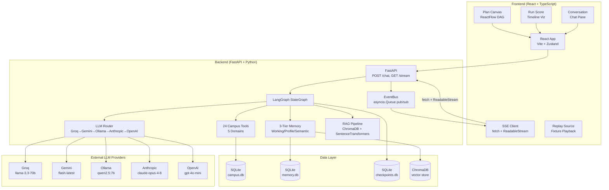
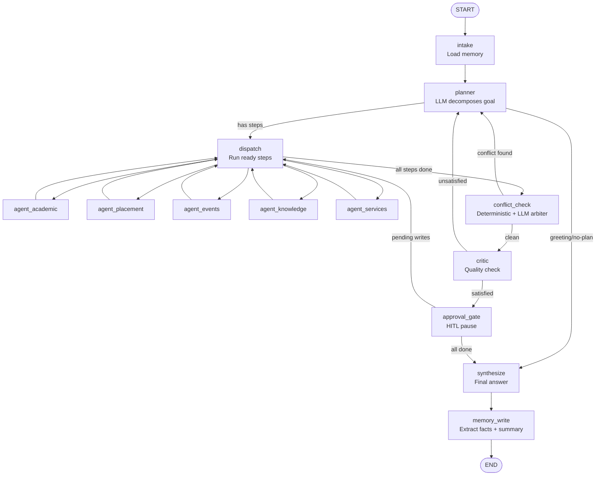
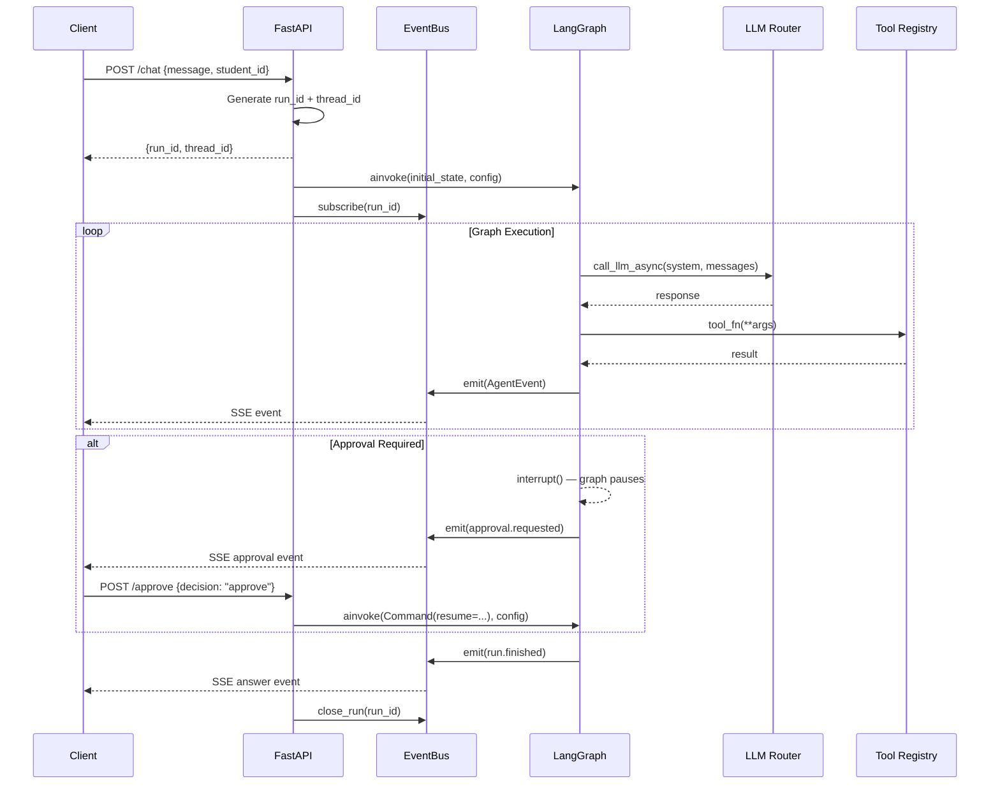
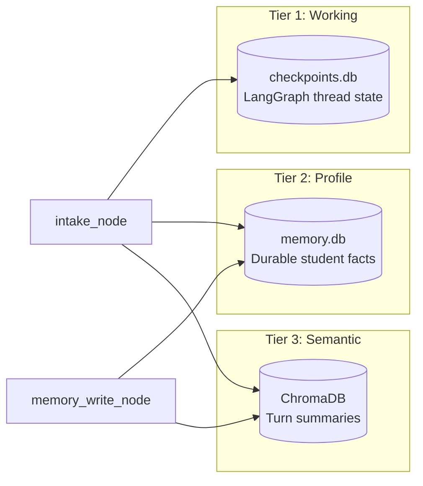
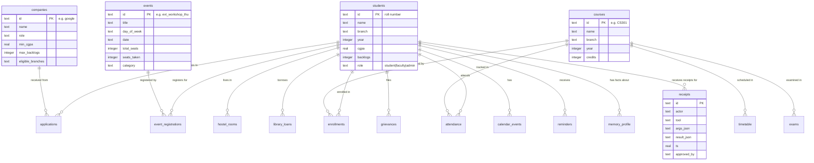

# Architecture

Technical architecture of the Sūtra Smart Campus Multi-Agent Orchestrator.

## System Overview

Sūtra is a **multi-agent orchestration system** that decomposes student questions into parallel specialist agent tasks, executes them against real campus data, detects conflicts, gates write actions for human approval, and streams every execution step to the frontend in real time.

**Architecture pattern:** Event-driven multi-agent pipeline with human-in-the-loop, built on LangGraph's StateGraph.

## High-Level System Architecture



## LangGraph Pipeline

The core execution pipeline is a LangGraph `StateGraph` with bounded replan loops.



### Node Responsibilities

| Node | File | Responsibility |
|------|------|---------------|
| `intake` | `graph/nodes.py` | Loads 3-tier memory block (profile facts + semantic recall) into state |
| `planner` | `graph/nodes.py` | LLM call to decompose user goal into a Plan (list of Steps with dependency DAG) |
| `dispatch` | `graph/nodes.py` | Routes to agents whose `depends_on` are satisfied; fans out in parallel |
| `agent_*` | `graph/agents.py` | Each specialist selects one tool via LLM, executes it, composes step result |
| `conflict_check` | `graph/nodes.py` | Deterministic preflight for schedule collisions + LLM arbiter for edge cases |
| `critic` | `graph/nodes.py` | LLM evaluates whether the plan answered the question |
| `approval_gate` | `graph/nodes.py` | Pauses graph (LangGraph interrupt) for human approve/reject/edit |
| `synthesize` | `graph/nodes.py` | Composes final answer from step results + action ledger |
| `memory_write` | `graph/nodes.py` | Extracts durable facts (LLM) + turn summary, persists to profile + semantic stores |

### Replan Mechanism

- **MAX_REPLAN_ITERATIONS = 2** — the planner can be called at most 2 times after the initial plan
- **MAX_REJECTION_REPLANS = 1** — a human rejection triggers at most 1 replan
- Replan is triggered by: conflict detection, critic dissatisfaction, or rejection

### Conditional Routing

```python
# planner → dispatch or synthesize (greeting gets no agents)
route_after_planner(state) → "dispatch" if steps else "synthesize"

# dispatch → agents + conflict_check (when all steps done)
route_ready_steps(state) → [agent_* for ready steps] + ["conflict_check" if all done]

# conflict_check → planner (replan) or critic (clean)
route_after_conflict(state) → "planner" if conflicts else "critic"

# critic → planner (replan) or approval_gate (satisfied)
route_after_critic(state) → "planner" if not satisfied else "approval_gate"

# approval_gate → dispatch (more steps) or synthesize (all done)
route_after_approval(state) → "dispatch" if pending writes else "synthesize"
```

## Frontend Architecture

### Component Tree

```
App.tsx
├── Header (mode switch, fixture selector, inbox, calendar, theme, locale)
├── Conversation (chat pane with voice input)
├── Center Panel
│   ├── MissionGallery (demo prompt cards)
│   ├── RunScore (timeline visualization)
│   └── PlanCanvas (ReactFlow DAG)
├── NodeInspector (click-to-inspect step details)
├── Rail (Timeline | Citations | Memory | Telemetry)
├── ApprovalModal (HITL approval gate UI)
├── InboxDrawer (notification inbox)
└── CalendarPage (student calendar view)
```

### State Management

- **Zustand store** (`state/store.ts`) — single source of truth for UI state, turns, run state, mode/theme/locale
- **Run reducer** (`state/runReducer.ts`) — pure function folding `AgentEvent`s into `RunState`
- **Epoch tracking** — transport callbacks capture the epoch they belong to; starting/stopping a run advances it, so late frames from abandoned requests cannot interfere

### Transport Layer

- **SSE Client** (`transport/sseClient.ts`) — custom `fetch` + `ReadableStream` implementation (NOT `EventSource`, which cannot handle named events or socket-close termination)
- **Replay Source** (`transport/replaySource.ts`) — plays golden JSONL fixtures with cinematic pacing, adjustable speed, pause/resume/seek
- **Shared interface** (`transport/types.ts`) — `EventTransport` interface implemented by both

### Key Frontend Decisions

1. **No `EventSource`** — every SSE frame is named (`event: node.started`); `EventSource.onmessage` only fires for unnamed frames
2. **Deduplication on `event.id`** — history is replayed to new subscribers
3. **Approval deduplication on `payload.id`** — approvals are re-emitted on every resume
4. **`plan.revised` has two incompatible payloads** — branch on `Array.isArray(payload.steps)`, not on type alone

## Backend Architecture

### Request Lifecycle



### EventBus

`apps/api/bus.py` implements a per-run pub/sub system:

- **`emit(event)`** — fans out an `AgentEvent` to all active subscribers for that `run_id`
- **`subscribe(run_id)`** — async generator yielding events; replays history for late subscribers
- **`close_run(run_id)`** — closes the SSE stream for a completed run
- Backed by `asyncio.Queue` per subscriber

### LLM Router

`apps/api/llm/router.py` implements a provider-agnostic call chain with automatic fallback:

| Priority | Provider | Model | Notes |
|----------|----------|-------|-------|
| 1 | Groq | `llama-3.3-70b-versatile` | Primary — fast, free tier, supports multiple API keys |
| 2 | Ollama | `qwen2.5:7b` (local) | No quota, no network dependency |
| 3 | Gemini | `gemini-flash-latest` | Fallback — free tier has low daily quota |
| 4 | Anthropic | `claude-opus-4-8` | Optional paid fallback |
| 5 | OpenAI | `gpt-4o-mini` | Optional paid fallback |

**Key behaviors:**
- `MOCK_LLM=1` — deterministic, zero-network responses for testing
- Provider timeout: 25s per provider, 20s per whole call chain
- Groq key rotation — multiple keys supported (`GROQ_API_KEY`, `GROQ_API_KEY_2`, ...), rotated on rate limit
- Client caching — TLS connections reused across calls
- IPv4 forced by default (IPv6 DNS resolution measured at 21s per connect)

### Tool Registry

24 tools across 5 specialist agents, registered in `apps/api/tools/registry.py`:

| Agent | Tools | Approval Required |
|-------|-------|-------------------|
| Academic | `get_timetable`, `get_attendance`, `compute_attendance_eligibility`, `check_schedule_conflict`, `recommend_electives` | None |
| Placement | `list_companies`, `check_placement_eligibility`, `analyze_resume`, `get_prep_plan` | None |
| Events | `search_events`, `get_event_capacity`, `register_event`, `recommend_clubs` | `register_event` |
| Knowledge | `search_policy`, `get_document_span` | None |
| Services | `get_hostel_info`, `library_loans`, `renew_book`, `file_grievance`, `draft_email`, `send_email`, `add_to_calendar`, `create_reminder`, `escalate_to_human` | `file_grievance`, `send_email` |

**Tool wrapping:** Every tool is wrapped with:
1. Chaos hook (fault injection)
2. Retry decorator (2 attempts)
3. Circuit breaker
4. Optional fallback (e.g., placement eligibility falls back to policy documents)

### Resilience Layer

`apps/api/tools/resilience.py` provides a `@resilient` decorator:
- **Retry:** 2 attempts on infrastructure errors
- **Circuit breaker:** Opens after repeated failures, returns fallback
- **Domain refusal passthrough:** `SeatsUnavailable`, `RecordNotFound`, `PermissionDenied` are NOT retried (they're correct "no" answers)
- **Fallback:** Tool-specific degraded responses (e.g., placement eligibility from policy docs when service is down)

## Memory Architecture

### 3-Tier Memory



| Tier | Storage | Content | Lifecycle |
|------|---------|---------|-----------|
| Working | `data/checkpoints.db` | Full graph state per thread | Per conversation |
| Profile | `data/memory.db` | Durable facts (preferences, goals, interests) | Cross-session |
| Semantic | `chroma_db/` | Vector-indexed turn summaries | Cross-session |

### Memory Flow

1. **Read** (`intake_node`): `load_memory_block()` queries profile facts + semantic recall → injects compact text block into planner/agent prompts
2. **Write** (`memory_write_node`): `write_turn_memory()` extracts facts via LLM → upserts to profile; summarizes exchange via LLM → adds to semantic store

### RAG Pipeline

`apps/api/rag/store.py`:
1. **Ingest:** Chunk policy documents (800-char chunks, 150-char overlap) → embed with `all-MiniLM-L6-v2` → store in ChromaDB
2. **Retrieve:** Embed query → cosine similarity search → return top-k chunks with clause metadata
3. **Citations:** Each chunk carries `doc_title`, `doc_number`, `clause`, `page`, `score`

## Database Architecture

SQLite database `data/campus.db` with 18 tables:



See [DATABASE.md](DATABASE.md) for the complete schema reference.

## External Integrations

### LLM Providers

- **Groq** — `groq` Python SDK, `api.groq.com`
- **Gemini** — `google-genai` Python SDK, `generativelanguage.googleapis.com`
- **Ollama** — `ollama` Python SDK, `localhost:11434` (local) or `ollama.com` (cloud)
- **Anthropic** — `anthropic` Python SDK
- **OpenAI** — `openai` Python SDK

### No Other External APIs

The system uses only SQLite for data. There are no connections to real ERP systems, email servers, or campus management platforms. All "services" are simulated through the tool layer.

## Configuration Management

- **`.env`** file for API keys (loaded by `python-dotenv` in `llm/router.py`)
- **Environment variables** for runtime configuration (`MOCK_LLM`, `OLLAMA_DISABLE`, `ALLOW_IPV6`, timeouts)
- **Hardcoded constants** for most configuration (agent names, tool registry, model names, timeouts)
- No centralized config file or settings class

## Security Considerations

- **No authentication** — student identity is a request parameter, not verified
- **CORS** — allows only `http://localhost:5173`
- **Role-based tool access** — `student < faculty < admin` hierarchy, but enforced only at the tool registry level
- **No input validation** beyond Pydantic request models
- **No rate limiting**
- **No HTTPS**

See [SECURITY.md](SECURITY.md) for the full security analysis.

## Known Architectural Limitations

1. **No authentication/authorization** — anyone can impersonate any student
2. **Single-process SQLite** — not suitable for concurrent production use
3. **No run cancellation** — abandoned graphs complete in the background
4. **`tool.retry` / `tool.fallback` node attribution** — may carry wrong `node_id` in parallel execution
5. **IPv6 forced off** — network-specific workaround, not a protocol decision
6. **No deployment infrastructure** — no Docker, CI/CD, or production configuration
7. **Hardcoded student ID** — frontend uses `1602-23-733-042` (Ananya Reddy) as the only user
8. **Mock LLM fragility** — mock dispatches on substring matching in system prompts; prompt rewording breaks mocks
