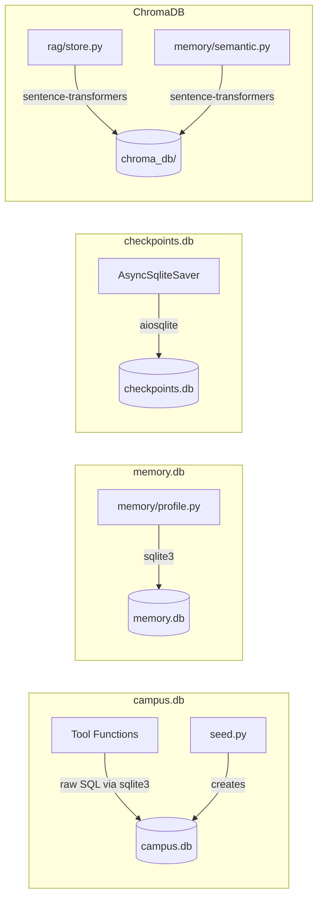
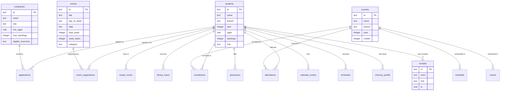

# Database

Complete database documentation for the Sūtra Smart Campus system.

## Database Technology

**SQLite** — used for all three databases:

| Database | File | Purpose |
|----------|------|---------|
| Campus data | `data/campus.db` | Students, courses, attendance, events, etc. |
| Memory | `data/memory.db` | Durable student facts (profile memory tier) |
| Checkpoints | `data/checkpoints.db` | LangGraph thread state persistence |

## Connection Architecture



**Note:** The campus database uses raw `sqlite3` (not SQLAlchemy ORM). The memory database uses raw `sqlite3`. The checkpoint database uses LangGraph's `AsyncSqliteSaver`.

## Campus Database Schema

**File:** `data/schema.sql`

18 tables total. See the full schema in the file.

### Tables

| Table | Purpose | Key Columns |
|-------|---------|-------------|
| `students` | Student records | `id` (roll number), `name`, `branch`, `year`, `cgpa`, `backlogs`, `role` |
| `courses` | Course catalog | `id` (e.g. CS301), `name`, `branch`, `year`, `credits` |
| `enrollments` | Student-course mappings | `student_id` FK, `course_id` FK |
| `attendance` | Attendance records | `student_id` FK, `course_id` FK, `classes_held`, `classes_attended` |
| `timetable` | Weekly schedule | `course_id` FK, `branch`, `year`, `day_of_week`, `start_time`, `end_time`, `session_type` |
| `exams` | Exam schedule | `course_id` FK, `exam_type`, `date`, `start_time` |
| `companies` | Placement companies | `id`, `name`, `role`, `min_cgpa`, `max_backlogs`, `eligible_branches` |
| `applications` | Placement applications | `student_id` FK, `company_id` FK, `status` |
| `events` | Campus events | `id`, `title`, `day_of_week`, `date`, `start_time`, `end_time`, `total_seats`, `seats_taken`, `category` |
| `event_registrations` | Event sign-ups | `event_id` FK, `student_id` FK, UNIQUE(event_id, student_id) |
| `clubs` | Student clubs | `id`, `name`, `category`, `description` |
| `hostel_rooms` | Hostel assignments | `student_id` FK, `block`, `room_number`, `no_dues` |
| `library_loans` | Book loans | `student_id` FK, `book_title`, `borrowed_at`, `due_at`, `returned` |
| `scholarships` | Scholarship records | `id`, `name`, `min_cgpa`, `max_income`, `deadline` |
| `grievances` | Student grievances | `student_id` FK, `category`, `description`, `status`, `filed_at` |
| `calendar_events` | Calendar writes | `student_id` FK, `title`, `date`, `start_time`, `end_time`, `source` |
| `reminders` | Student reminders | `student_id` FK, `message`, `remind_at` |
| `receipts` | Audit trail for writes | `id`, `actor`, `tool`, `args_json`, `result_json`, `ts`, `approved_by` |
| `memory_profile` | Durable student facts | `student_id` FK, `key`, `value`, `confidence`, `evidence_turn`, `updated_at` |

### ER Diagram



### Relationships

| From | To | Type | FK |
|------|----|------|----|
| `enrollments.student_id` | `students.id` | Many-to-One | Yes |
| `enrollments.course_id` | `courses.id` | Many-to-One | Yes |
| `attendance.student_id` | `students.id` | Many-to-One | Yes |
| `attendance.course_id` | `courses.id` | Many-to-One | Yes |
| `timetable.course_id` | `courses.id` | Many-to-One | Yes |
| `applications.student_id` | `students.id` | Many-to-One | Yes |
| `applications.company_id` | `companies.id` | Many-to-One | Yes |
| `event_registrations.event_id` | `events.id` | Many-to-One | Yes |
| `event_registrations.student_id` | `students.id` | Many-to-One | Yes |
| `hostel_rooms.student_id` | `students.id` | Many-to-One | Yes |
| `library_loans.student_id` | `students.id` | Many-to-One | Yes |
| `grievances.student_id` | `students.id` | Many-to-One | Yes |
| `calendar_events.student_id` | `students.id` | Many-to-One | Yes |
| `reminders.student_id` | `students.id` | Many-to-One | Yes |
| `memory_profile.student_id` | `students.id` | Many-to-One | Yes |

### Indexes

No explicit indexes beyond primary keys and the UNIQUE constraint on `event_registrations(event_id, student_id)`.

### Constraints

| Table | Constraint | Type |
|-------|-----------|------|
| `event_registrations` | `UNIQUE(event_id, student_id)` | Prevents double registration |
| `students.role` | `DEFAULT 'student'` | Default role |
| `timetable.session_type` | `DEFAULT 'lecture'` | Default session type |
| `event_registrations.seats_taken` | `DEFAULT 0` | Default seat count |
| `grievances.status` | `DEFAULT 'open'` | Default grievance status |

### Primary/Foreign Keys

| Table | Primary Key | Foreign Keys |
|-------|-------------|--------------|
| `students` | `id` (TEXT) | — |
| `courses` | `id` (TEXT) | — |
| `enrollments` | `id` (INTEGER AUTOINCREMENT) | `student_id`, `course_id` |
| `attendance` | `id` (INTEGER AUTOINCREMENT) | `student_id`, `course_id` |
| `timetable` | `id` (INTEGER AUTOINCREMENT) | `course_id` |
| `exams` | `id` (INTEGER AUTOINCREMENT) | `course_id` |
| `companies` | `id` (TEXT) | — |
| `applications` | `id` (INTEGER AUTOINCREMENT) | `student_id`, `company_id` |
| `events` | `id` (TEXT) | — |
| `event_registrations` | `id` (INTEGER AUTOINCREMENT) | `event_id`, `student_id` |
| `clubs` | `id` (TEXT) | — |
| `hostel_rooms` | `id` (INTEGER AUTOINCREMENT) | `student_id` |
| `library_loans` | `id` (INTEGER AUTOINCREMENT) | `student_id` |
| `scholarships` | `id` (TEXT) | — |
| `grievances` | `id` (INTEGER AUTOINCREMENT) | `student_id` |
| `calendar_events` | `id` (INTEGER AUTOINCREMENT) | `student_id` |
| `reminders` | `id` (INTEGER AUTOINCREMENT) | `student_id` |
| `receipts` | `id` (TEXT) | — |
| `memory_profile` | `id` (INTEGER AUTOINCREMENT) | `student_id` |

## Seed Data

**File:** `scripts/seed.py`

### Demo Personas

| Student | Branch | Year | CGPA | Backlogs | Roll |
|---------|--------|------|------|----------|------|
| Ananya Reddy | CSE | 3 | 8.4 | 0 | 1602-23-733-042 |
| Rahul Verma | MECH | 2 | 7.2 | 2 | 1602-24-736-018 |

### Key Seed Data

- **40 students** (2 exact + 38 generated with `random.seed(42)`)
- **8 courses** (CSE 3rd year focus)
- **Ananya's timetable:** DBMS Lab Thu 14:00-16:00 (the collision anchor)
- **Ananya's attendance:** DBMS Lab 26/37 (~70.3%, below 75% bar)
- **8 companies:** Google (min CGPA 8.0), Goldman (8.5), Microsoft (7.5), TCS (6.0), Infosys (6.5), Amazon (7.8), Deloitte (7.0), Bosch (6.8)
- **12 events:** Placement workshops (Thu + Sat), AI/ML workshops, hackathon, clubs, career fair
- **8 clubs:** Technical and cultural
- **Ananya's hostel:** B-Block Room 214, no-dues = 1
- **Ananya's library loan:** "Database System Concepts", due 2026-08-20

## Database Access Layer

### Tool Functions

All tool functions in `apps/api/tools/` access the database directly via `sqlite3`:

```python
# apps/api/tools/db.py
from sqlalchemy import create_engine
engine = create_engine("sqlite:///data/campus.db")
```

### Memory Profile

```python
# apps/api/memory/profile.py
import sqlite3
DB_PATH = "data/memory.db"
# Direct sqlite3 for CRUD on memory_profile table
```

### Checkpoints

```python
# apps/api/graph/build.py
from langgraph.checkpoint.sqlite.aio import AsyncSqliteSaver
# AsyncSqliteSaver wraps aiosqlite for LangGraph state persistence
```

## Data Lifecycle

1. **Seed** — `scripts/seed.py` wipes and rebuilds `campus.db`
2. **Read** — tools query SQLite for student data, attendance, events, etc.
3. **Write** — approved tools write to SQLite and insert a `receipts` row
4. **Memory** — after each turn, facts are upserted to `memory_profile` and summaries to ChromaDB
5. **Checkpoints** — LangGraph saves graph state to `checkpoints.db` after each node
6. **Reset** — `scripts/reset_demo.sh` wipes all databases and re-seeds

## Important Queries

### Attendance Eligibility

```sql
SELECT classes_attended, classes_held,
       100.0 * classes_attended / classes_held AS pct
FROM attendance
WHERE student_id = ? AND course_id = ?
```

### Schedule Conflict Check

```sql
SELECT t.*, c.name
FROM timetable t
JOIN courses c ON t.course_id = c.id
WHERE t.branch = ? AND t.year = ? AND t.day_of_week = ?
  AND t.start_time < ? AND t.end_time > ?
```

### Event Seat Availability

```sql
SELECT total_seats - seats_taken AS remaining
FROM events WHERE id = ?
```

### Placement Eligibility

```sql
SELECT * FROM companies WHERE id = ?
-- Check: min_cgpa <= student.cgpa
-- Check: max_backlogs >= student.backlogs
-- Check: student.branch IN eligible_branches.split(',')
```
